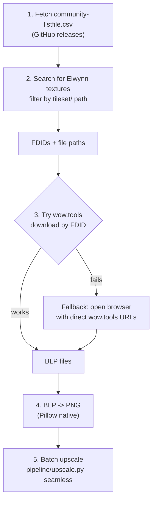

# Phase 2: Real WoW Textures

## Goal

Replace our procedural test textures with actual Elwynn Forest ground textures and model reference images, run them through the pipeline, and see real results.

## Download Strategy




### Step 1: Community listfile

Download from `https://github.com/wowdev/wow-listfile/releases/latest/download/community-listfile.csv` (~70MB CSV). Format: `FileDataID;filepath`. Cache locally in `assets/listfile.csv`.

### Step 2: Search for Elwynn textures

Filter the listfile for paths matching:

- `tileset/elwynn/` -- zone-specific textures (grass, dirt, rock, leaf)
- `tileset/generic/` -- shared ground textures (cobblestone, road, mud, farmland)
- `world/maps/azeroth/` -- Elwynn terrain ADT references (for future terrain work)
- `*.blp` extension only

Display results with FDIDs so the user can see what's available.

### Step 3: Download files from wow.tools

The wow.tools download URL format (commonly referenced in the modding community):

```
https://wow.tools/casc/file/fdid?id={fdid}
```

Try this with requests + a reasonable User-Agent header. If it works, batch download all filtered BLP files. If it's blocked or rate-limited, fall back to opening the URLs in the browser for manual download.

### Step 4: BLP to PNG conversion

Already built in [extract/download.py](extract/download.py) -- Pillow reads BLP natively. Just batch-convert the downloaded `.blp` files to PNG in `assets/input/`.

### Step 5: Batch upscale

Run the existing pipeline on real textures:

```bash
python -m pipeline.upscale assets/input/ --seamless -s 4
```

## Implementation: Upgrade extract/download.py

Expand [extract/download.py](extract/download.py) with three new subcommands:

- `python -m extract.download fetch-listfile` -- downloads and caches the community listfile
- `python -m extract.download search <query>` -- searches the listfile (e.g. "elwynn", "tileset/generic", "goldshire")
- `python -m extract.download get <fdid> [fdid...]` -- downloads specific files by FDID from wow.tools, converts BLP to PNG
- `python -m extract.download elwynn` -- convenience command that fetches all known Elwynn ground textures

Keep the existing `list` and `convert` subcommands.

## What we'll have after this

- 10-15 real WoW ground textures from Elwynn Forest, upscaled from 256x256 to 1024x1024
- Side-by-side comparison possible: drag original and upscaled textures into the viewer
- Real data to evaluate whether the upscaling quality is good enough for the project

