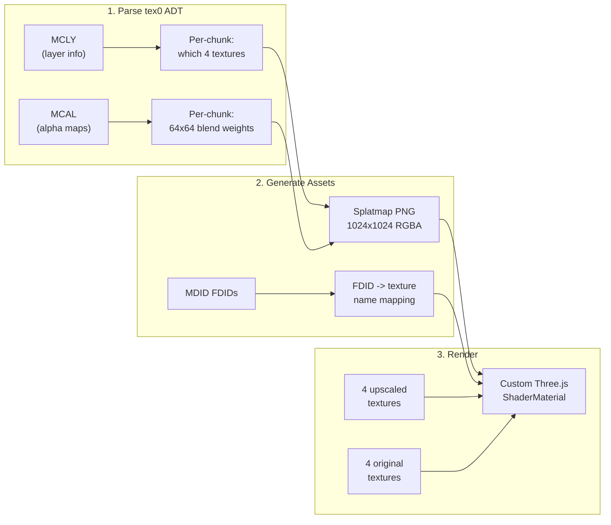

# Phase 4: Multi-Texture Terrain Splatting

## The visual upgrade

Currently the terrain is covered with a single grass texture. Real Elwynn Forest has multiple textures blended per chunk -- grass fading into dirt paths, cobblestone roads, rocky outcrops, flower patches. This phase adds that blending.

## Current texture situation

The MDID chunk in tex0 ADTs stores specular (`_s.blp`) FDIDs. The diffuse textures have adjacent FDIDs:

| MDID FDID | Specular path           | Diffuse FDID | Diffuse name          | Downloaded? | Upscaled? |
| --------- | ----------------------- | ------------ | --------------------- | ----------- | --------- |
| 187127    | elwynngrassbase_s       | 187126       | elwynngrassbase       | Yes         | Yes       |
| 187115    | elwynndirtbase2_s       | 187114       | elwynndirtbase2       | Yes         | No        |
| 187138    | elwynnrockbasetest2_s   | 187137       | elwynnrockbasetest2   | Yes         | No        |
| 187125    | elwynnflowerbase_s      | 187124       | elwynnflowerbase      | Yes         | Yes       |
| 187100    | elwynncobblestonebase_s | 187099       | elwynncobblestonebase | Yes         | Yes       |

We need to upscale **elwynndirtbase2** and **elwynnrockbasetest2** to complete the set.

## Implementation steps

### 1. Extend ADT parser with MCLY + MCAL parsing

In [pipeline/adt.py](pipeline/adt.py):

- Parse MCNK chunks in tex0 ADT (they have NO 128-byte header in split format)
- Extract MCLY: per-chunk texture layer definitions (texture index, flags, alpha offset)
- Extract MCAL: per-chunk alpha maps (64x64 uint8 per non-base layer)
- Output: per-chunk layer data with alpha maps

### 2. Generate splatmap images

For each ADT tile, generate a **1024x1024 RGBA PNG** splatmap:

- 16x16 chunks, each chunk contributes 64x64 pixels
- R channel = layer 1 alpha, G = layer 2, B = layer 3, A = layer 4 (layer 0 is derived as 1 - sum)
- Also export a JSON mapping: texture index -> diffuse texture filename

Save to `assets/terrain/{tile}_splatmap.png` and `{tile}_texmap.json`.

### 3. Upscale missing textures

Run the upscale pipeline on `elwynndirtbase2.png` and `elwynnrockbasetest2.png` with `--seamless`.

### 4. Custom Three.js splatting shader

In [viewer/src/app.js](viewer/src/app.js):

- Load 4-5 terrain textures (both original and upscaled sets)
- Load the splatmap for each tile
- Create a `ShaderMaterial` that:
  - Samples the splatmap at each fragment's UV
  - Blends 4 texture layers based on splatmap RGBA weights
  - Base layer (grass) shows where all alphas are 0
- The T key swaps between original and upscaled texture sets

### 5. Copy assets to viewer directory

Copy splatmaps and the additional textures (dirt, rock, cobblestone, flower) to `viewer/textures/`.