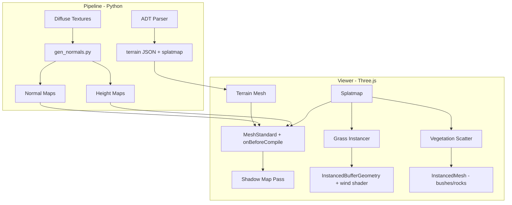

# Next-Gen Terrain Rendering

All work centers on `[viewer/src/app.js](viewer/src/app.js)` (the renderer) and `[pipeline/](pipeline/)` (asset generation).

## Stage 1: Normal Maps on Terrain Textures

**Impact: High | Effort: Low** -- best bang-for-buck, do first.

Currently the terrain shader uses only diffuse textures with a single `dot(N, L)` light calculation. Normal maps add per-pixel surface detail (bumps, cracks, grain) without extra geometry.

- **Pipeline**: Add a Python script `pipeline/gen_normals.py` that generates normal maps from existing terrain textures using a Sobel filter (no AI needed -- pure image processing). Output to `viewer/textures/normals/{name}_n.png`.
- **Shader**: Upgrade `SPLAT_FRAG` to sample 4 normal maps (one per terrain layer), blend them with the same splatmap weights, then perturb `vNormal` using a TBN matrix built from the terrain surface. The lighting calc then uses the perturbed normal instead of the flat geometric normal.
- **Uniforms**: Add `texBaseN`, `texRN`, `texGN`, `texBN` sampler2D uniforms.

## Stage 2: Shadow Mapping

**Impact: High | Effort: Medium**

Currently no shadows exist at all. Trees and buildings float visually.

- **Approach**: Migrate terrain material from raw `ShaderMaterial` to `MeshStandardMaterial.onBeforeCompile`, injecting our splatmap + normal map logic into the PBR pipeline. This gives us shadow receiving, PBR lighting, and fog integration for free.
- **Renderer**: Enable `renderer.shadowMap.enabled = true`, `renderer.shadowMap.type = THREE.PCFSoftShadowMap`.
- **Sun light**: Configure `sun.castShadow = true` with a shadow camera sized to cover the loaded terrain area. Use `THREE.CameraHelper` during dev to tune bounds.
- **Objects**: Set `castShadow = true` on M2/WMO meshes (trees, buildings). Set `receiveShadow = true` on terrain meshes.
- **Performance**: Shadow map resolution 2048 or 4096. Consider cascaded shadow maps (`THREE.CSM` from addons) if a single map isn't sharp enough across the large terrain.

## Stage 3: Parallax / Heightmap Textures

**Impact: Medium | Effort: Medium**

Makes terrain textures appear to have physical depth -- cobblestones protrude, dirt has ruts.

- **Pipeline**: Extend `gen_normals.py` to also output grayscale heightmaps (`{name}_h.png`) derived from luminance of the diffuse texture (or a more sophisticated approach using the normal map).
- **Shader**: Implement Parallax Occlusion Mapping (POM) in the fragment shader. Before sampling diffuse + normal textures, ray-march through the heightmap to offset the UV. ~~8-16 steps is a good balance. Add a `heightScale` uniform (~~0.03-0.05).
- **Optimization**: Only apply POM at close range; fall back to simple parallax or flat sampling at distance using a distance-based blend.

## Stage 4: Procedural Vegetation Scatter

**Impact: Medium | Effort: Medium**

Auto-place extra bushes, flowers, and rocks based on terrain type, filling empty areas.

- **Splatmap sampling**: After terrain loads, read splatmap pixel data via a canvas. For each cell in a grid (~2-4 unit spacing), determine terrain type from splat channels.
- **Placement rules**:
  - Grass zones (low R+G+B): scatter `elwynnbush09`, `kalidarbush04`, `wetlandgrass02`, flower clusters
  - Dirt zones (high R): sparse rocks, `hyjalbushburnt01`
  - Rock zones (high G): `elwynnrock1`, `elwynnrock2`, `elwynncliffrock01`
  - Cobblestone zones: skip (built-up areas)
- **Distribution**: Poisson disk sampling for natural spacing. Random rotation, slight scale variation (0.8-1.2x).
- **LOD**: Only scatter within a radius of the camera; or pre-scatter everything and use frustum culling (Three.js does this on InstancedMesh automatically).
- **Integration**: Uses existing `loadModelJson` / `buildM2Submeshes` pipeline.

## Stage 5: Procedural Grass

**Impact: Very High | Effort: High** -- the showpiece feature.

GPU-instanced grass blades covering grassy terrain areas.

- **Geometry**: A single grass blade = 3-segment triangle strip (6 vertices). Width ~0.3, height ~1.5-3.0 with variation.
- **Instancing**: `InstancedBufferGeometry` with per-instance attributes:
  - `instancePosition` (vec3) -- world XZ from terrain, Y from heightmap lookup
  - `instanceRotation` (float) -- random yaw
  - `instanceScale` (float) -- 0.7-1.3 random
  - `instanceColor` (vec3) -- slight hue/brightness variation
- **Placement**: Sample splatmap; only place grass where `1.0 - splat.r - splat.g - splat.b > 0.5` (predominantly grass). Grid-jittered distribution, ~50k-200k blades per tile.
- **Vertex shader**: Wind animation using `sin(time * speed + worldPos.x * freq) * bendAmount`, stronger at blade tip (multiply by height-along-blade parameter). Two sine waves at different frequencies for natural motion.
- **Fragment shader**: Color gradient from dark green at base to light yellow-green at tip. Alpha cutoff at blade edges. Fades to transparent at distance for LOD.
- **Performance**: Distance-based density reduction. Only render grass within ~200-300 units of camera. Use `shader.uniforms.time` updated in the render loop.

## Architecture After All Stages

## Recommended Implementation Order

1. **Normal maps** -- foundation for everything, immediate visual upgrade
2. **Shadow mapping** -- requires shader migration to onBeforeCompile, which benefits all later stages
3. **Parallax heightmaps** -- builds on the PBR shader from stage 2
4. **Vegetation scatter** -- uses existing M2 pipeline, moderate effort
5. **Procedural grass** -- most complex, do last when everything else is stable

