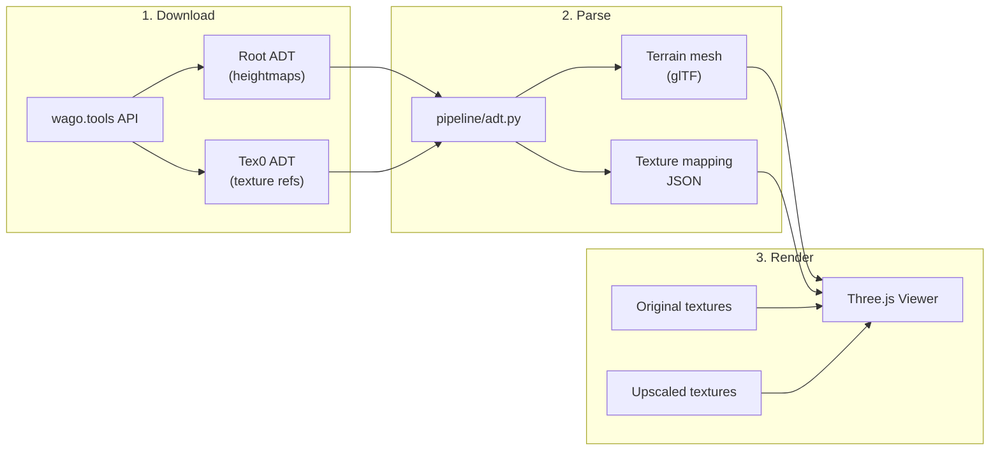

# Phase 3: Elwynn Terrain in the Viewer

## What we're building

A flyable 3D render of actual Elwynn Forest terrain with our AI-upscaled textures applied. The viewer will have a before/after toggle to switch between original WoW textures and the upscaled versions.

## Step 1: Download ADT terrain data

Extend [extract/download.py](extract/download.py) with an `adt` subcommand.

Elwynn Forest core tiles (confirmed FDIDs):

- Tiles (32-34) x (47-52) = 18 root ADTs + 18 tex0 ADTs
- Start with **1 tile** for development: `azeroth_32_49.adt` (Goldshire area)
- Root ADT contains heightmaps (MCVT); tex0 ADT contains texture layer info (MCLY/MCAL/MTEX)

## Step 2: Parse ADT heightmaps

Create [pipeline/adt.py](pipeline/adt.py) -- a Python ADT parser.

**ADT binary format** (v18, well-documented at [wowdev.wiki/ADT](https://wowdev.wiki/ADT/v18)):

- IFF-like chunked format: 4-byte magic + 4-byte size + data
- Root ADT has 256 MCNK chunks (16x16 grid), each with MCVT sub-chunk
- MCVT: 145 floats per chunk (9x9 outer verts + 8x8 inner verts)
- Each chunk is 33.33 yards; full tile is 533.33 yards

Key data to extract:

- **Heights**: MCVT from root ADT (generates terrain mesh geometry)
- **Texture list**: MTEX from tex0 ADT (which BLP textures this tile uses)
- **Texture layers**: MCLY from tex0 ADT (which textures go on which chunk, up to 4 layers)
- **Alpha maps**: MCAL from tex0 ADT (blending between layers, 64x64 per layer per chunk)

Output: a glTF file with the terrain mesh + a JSON sidecar mapping chunk coordinates to texture names.

## Step 3: Export terrain as glTF

The mesh generation from MCVT heights:

- 16x16 chunks, each chunk has a 9x9 vertex grid (outer vertices)
- Total: ~144x144 vertex grid per tile = ~20K vertices
- Triangulate with standard grid indices
- UV coordinates map to the texture tiling

For MVP, apply a single material (our upscaled grass) to the whole mesh. The JSON sidecar preserves the per-chunk texture mapping for future multi-texture blending.

## Step 4: Upgrade the Three.js viewer

Enhance [viewer/src/app.js](viewer/src/app.js) with:

**Terrain loading**:

- Load terrain glTF mesh on startup (from a `terrain/` subdirectory served alongside the viewer)
- Replace the flat green ground plane with actual terrain geometry

**Fly camera** (PointerLockControls + WASD):

- Click to lock pointer, WASD to move, mouse to look
- Shift to speed up, Space to ascend, C to descend
- Much more immersive than orbit controls for zone exploration

**Before/after comparison**:

- Toggle key (T) or button to switch between original and upscaled textures
- Both texture sets loaded, swap material maps on toggle
- HUD indicator showing which mode is active

**Texture gallery** (stretch):

- Side panel showing all available textures with before/after thumbnails
- Click to apply to the terrain preview plane

## Scope control

Start with a single tile, single texture. Iterate from there:

1. One ADT tile, one texture, fly camera -- prove the pipeline works
2. Add before/after toggle
3. Add more tiles (stitch together)
4. Add multi-texture blending with alpha maps

