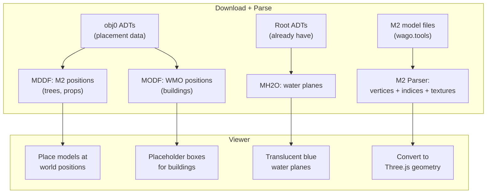

# Phase 5: Water, Doodads, and Buildings

## What we're adding

Populate the terrain with water planes, trees, rocks, props, and building placeholders. The scene goes from bare terrain to a living Elwynn landscape.

## Data sources

**obj0 ADT** (need to download): Contains MDDF and MODF chunks with object placements. Also has MMDX/MWMO (model file lists) and MMID/MWID (name indices).

In the modern chunked format, obj0 uses MLMD (MODF replacement with file data IDs) and MLDD (MDDF replacement with file data IDs).

**MH2O** (already in root ADT): Water planes -- height, type, and extent per chunk.

**M2 files** (download via wago.tools): Binary model files. Need the M2 + associated .skin file for each model.

## Implementation steps

### 1. Download obj0 ADTs and parse placement data

Extend [extract/download.py](extract/download.py) to also grab obj0 files. Parse MDDF/MLDD for M2 placements and MODF/MLMD for WMO placements from the obj0 ADTs. Each entry has:

- File data ID (or name index)
- World position (3 floats)
- Rotation (3 floats, degrees)
- Scale (uint16, 1024 = 1.0)

Export as `{tile}_objects.json` with arrays of positioned objects.

### 2. Parse MH2O water from root ADTs

The MH2O chunk in root ADTs has a 256-entry header table (one per MCNK chunk), each pointing to water layer data with:

- Water type (river, ocean, magma)
- Min/max height
- Which sub-cells have water (8x8 bitmask)

Export water plane definitions as part of the terrain JSON.

### 3. Build M2 model parser

Create [pipeline/m2.py](pipeline/m2.py):

- Parse MD21 chunked format (Legion+ M2 files)
- Extract global vertex list (48 bytes each: position, normals, UVs)
- Find and download associated .skin file (LOD 0)
- Parse skin file for triangle indices + submesh definitions
- Read texture file data IDs from M2 header
- Export as JSON (vertices, indices, texture FDIDs) for the viewer to build BufferGeometry

### 4. Download key Elwynn M2 models

Search the listfile for Elwynn-specific M2 models:

- Trees: `world/nodxt/detail/elwynntree*.m2` or similar
- Props: fences, barrels, signs, rocks
- Download the M2 + skin + texture BLP files via wago.tools

### 5. Render in the viewer

Upgrade [viewer/src/app.js](viewer/src/app.js):

- **Water**: For each chunk with MH2O data, create a translucent blue plane at the water height
- **M2 doodads**: Load parsed M2 geometry as BufferGeometry, place instances at MDDF positions with correct rotation/scale
- **WMO buildings**: Render as semi-transparent gray boxes at MODF positions (full WMO parsing is a separate phase)
- **Instancing**: Use InstancedMesh for repeated models (e.g. same tree type placed 200 times)

## Complexity notes

- **M2 parser scope**: Static geometry only (no animations, no particles, no ribbons). Just vertices, triangles, and diffuse textures.
- **WMO**: Placeholder boxes only in this phase. Proper WMO group parsing is Phase 6.
- **Texture handling**: Download referenced BLP textures, convert to PNG, load in viewer.

