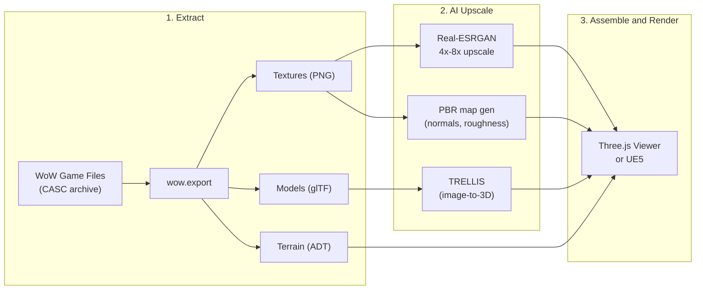

# Dawnlight: AI Upscale Elwynn Forest

## The Big Picture




## Phase 1: Asset Extraction

**Tool: [wow.export](https://github.com/Kruithne/wow.export)**

- Reads WoW's CASC archive directly -- no need to reverse-engineer file formats
- Exports terrain tiles (ADT), models (M2/WMO to glTF/OBJ), and textures (BLP to PNG)
- Can export an entire map tile with all doodads/WMOs placed in their world positions

**What we extract from Elwynn Forest:**

- ~30-40 terrain tiles (ADT files) covering the zone -- each tile has heightmap + texture layers + object placement data
- Ground textures: grass, dirt, cobblestone, mud, road (these tile across terrain)
- WMO models: Goldshire Inn, Northshire Abbey, farmhouses, towers, bridges
- M2 models: trees (the iconic Elwynn oaks), bushes, fences, barrels, signs, rocks
- Water planes and vertex colors for terrain shading

**Alternative extraction path**: If we want finer control, use Python with `pywowlib` or write custom parsers. But wow.export gets us 90% of the way with a GUI.

## Phase 2: AI Texture Upscale Pipeline (Python)

This is the core of the project -- a Python pipeline in this repo.

**2a. Texture Upscaling with Real-ESRGAN**

- WoW's original ground textures are typically 256x256 or 512x512
- Upscale to 2048x2048 or 4096x4096 using Real-ESRGAN (specifically the `realesrgan-x4plus` model)
- Works extremely well on hand-painted/stylized textures
- Batch process all extracted textures

**2b. PBR Material Generation**

- WoW Classic only has diffuse textures (no normal/roughness/metallic maps)
- Use AI to generate PBR maps from the upscaled diffuse:
  - **Normal maps**: DeepBump or a custom CNN -- generates height/normal detail from color
  - **Roughness/AO**: Can derive from diffuse luminance + AI refinement
- This is what makes the biggest visual difference -- suddenly grass looks like grass, stone looks like stone

**2c. Creative Enhancement with Stable Diffusion (optional/experimental)**

- Use SD img2img at low denoise strength (0.2-0.4) to add realistic detail while keeping WoW's style
- Best for ground textures where you want to bridge "painted" to "photorealistic-but-stylized"
- ControlNet with the original texture as reference to maintain tileability

**Tech stack (using fal.ai for all inference):**

- Python 3.11+
- `fal-client` -- API calls to fal.ai hosted models (Real-ESRGAN, SD, TRELLIS)
- `Pillow`, `opencv-python` for image processing
- No local GPU needed -- all heavy compute runs on fal's cloud
- `.env` with `FAL_API_KEY` (already configured)

## Phase 3: AI Mesh Enhancement with TRELLIS

**[TRELLIS](https://github.com/microsoft/TRELLIS)** (by Microsoft) generates 3D assets from images. The approach:

1. Render reference images of key WoW objects (multiple angles)
2. Feed into TRELLIS to generate high-quality 3D meshes with textures
3. Best candidates for re-generation:
  - **Trees** -- WoW trees are very low-poly; TRELLIS can generate lush, detailed versions
  - **Buildings** -- Goldshire Inn as a hero asset
  - **Props** -- Barrels, crates, fences, signs
4. Export as glTF with PBR materials

**Practical note**: TRELLIS works best with clean reference images. We'd render WoW objects against a clean background, optionally use multiple views for better results.

**Alternative/complement**: InstantMesh, TripoSR, or other image-to-3D models depending on quality.

## Phase 4: Scene Assembly and Viewer

Two viable paths (pick one or do both):

**Option A: Three.js Web Viewer (most shareable)**

- Load the upscaled terrain + models in a web browser
- Fly camera with WASD controls
- PBR rendering with environment lighting
- Post-processing: bloom, tone mapping, fog
- Easy to share a link -- great for posting

**Option B: Unreal Engine 5 (most impressive)**

- Import upscaled assets into UE5
- Lumen for global illumination, Nanite for mesh detail
- Record cinematic flythrough video
- Most visually dramatic result for a comparison video

**Recommendation**: Start with Three.js for fast iteration and shareability. If results look promising, do a UE5 cinematic render for the "wow factor" post.

## Repo Structure

```
dawnlight/
  extract/          -- scripts/config for asset extraction
  pipeline/
    upscale.py      -- Real-ESRGAN batch texture upscaler
    pbr_gen.py      -- PBR map generation from diffuse
    sd_enhance.py   -- optional SD img2img enhancement
    trellis_3d.py   -- TRELLIS mesh generation wrapper
    config.py       -- paths, model configs, zone params
  viewer/           -- Three.js web viewer
    index.html
    src/
  assets/           -- (gitignored) extracted + upscaled assets
  requirements.txt
  README.md
```

## What Makes This Postable

The killer content is the **side-by-side comparison**:

- Split-screen: original WoW Elwynn vs. AI-upscaled Elwynn
- Same camera angle, same landmarks
- Ground texture close-ups showing 256x256 vs 4096x4096
- Goldshire Inn low-poly vs TRELLIS-generated
- Before/after fly-through video

## Risks and Gotchas

- **TRELLIS mesh quality** varies -- some objects will look great, others won't. Cherry-pick the best results for hero shots
- **Texture tiling** -- upscaled textures may lose seamless tiling. Need a tiling-aware upscale pass
- **Scale/style coherence** -- mixing AI-generated meshes with original terrain can look jarring. Consistent lighting helps a lot
- **Legal**: This is a fan/research project using game assets. Fine for personal use and portfolio posts; don't distribute the extracted assets themselves

