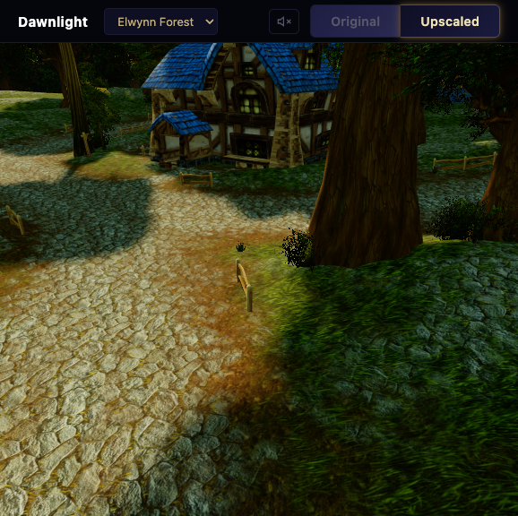
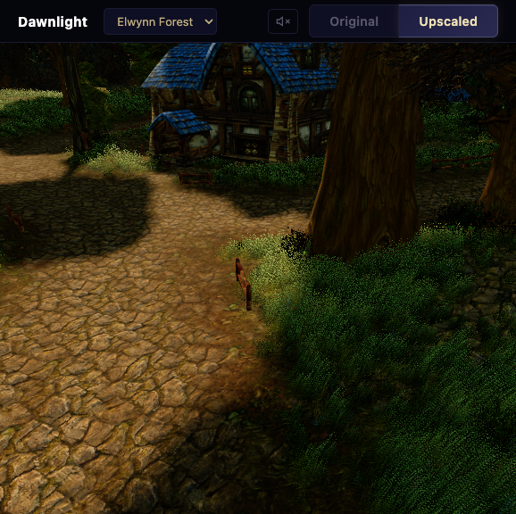

# Dawnlight

AI-upscaled World of Warcraft landscapes in your browser.

**[Live Demo →](https://mikekovetsky.github.io/dawnlight/)**

| Original | AI-Upscaled |
|----------|-------------|
|  |  |

---

Toggle between original and AI-enhanced textures in real-time. Classic low-res textures go through [fal.ai](https://fal.ai) Nano Banana Pro to produce high-resolution PBR materials with normal maps, parallax, and shadows.

Zones: **Elwynn Forest** (Goldshire) · **Nagrand**

## Features

- Multi-texture terrain with splatmap blending
- AI-upscaled textures via fal.ai Nano Banana Pro
- Normal maps · parallax heightmaps · shadow mapping
- 62 M2 models + 17 WMO buildings
- Procedural vegetation and GPU-instanced grass
- Ambient music

<details>
<summary>Developer Setup</summary>

### Run locally

```bash
python -m venv .venv && source .venv/bin/activate
pip install -r requirements.txt
cd viewer && python -m http.server 8081
```

### Upscale any game's textures

Create `.env` with `FAL_KEY=your_key`, then:

```bash
python -m pipeline.upscale_dir ./textures/ -o ./upscaled/ \
  --prompt "fantasy RPG" --normals --heights --workers 6
```

Use `--normals-dir` / `--heights-dir` to write PBR maps to separate
directories instead of alongside the diffuse textures.

For WoW zones there's a shortcut that picks the right prompts and output
layout automatically:

```bash
python -m pipeline.upscale_zone nagrand
```

### Add a WoW zone

```bash
python -m extract.download adt --tile 17,35 --map expansion01
python -m pipeline.adt assets/adt/expansion01_17_35.adt
python -m pipeline.obj0 assets/adt/expansion01_17_35_obj0.adt
```

See [docs/](docs/) for architecture, progress, and learnings.

</details>

<details>
<summary>Pipeline</summary>

```
WoW CDN ──► Download ──► BLP/ADT/M2 files
                              │
             ┌────────────────┼────────────────┐
             ▼                ▼                ▼
        ADT Parser       Texture Conv      M2 Parser
             │                │                │
             ▼                ▼                ▼
        terrain JSON     Nano Banana Pro    model JSON
             │           (fal.ai, 4K)          │
             └────────────────┼────────────────┘
                              ▼
                        Three.js Viewer
```

</details>
