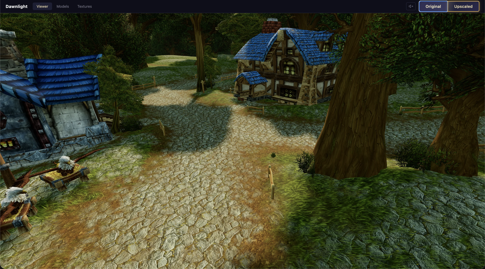
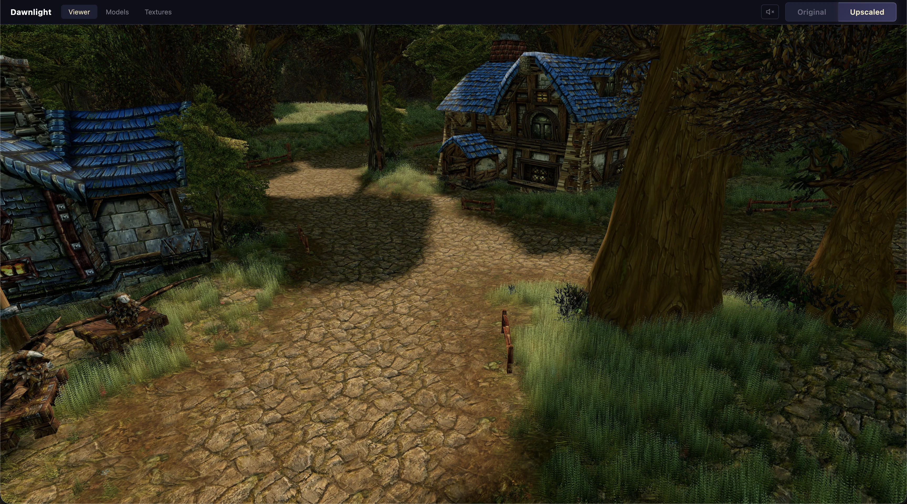
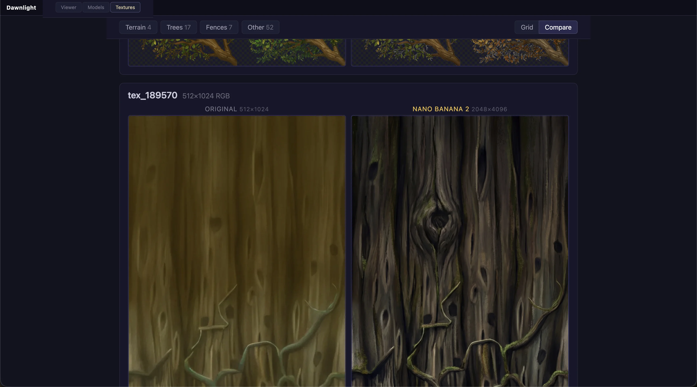
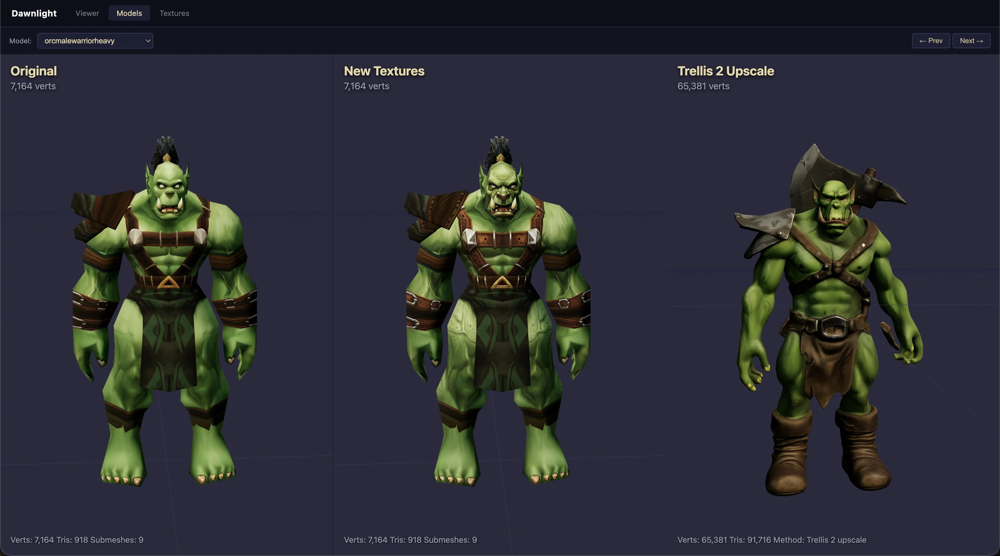

# Dawnlight

Thousands of beloved games sit dormant because they "look bad" to a new generation of players. Remastering them is prohibitively expensive -- millions of legacy 3D models and textures, some 20 years old, that need to be modernized by hand.

Dawnlight is an AI pipeline that upscales game textures in hours, not months. Point it at a folder of old-school textures, and it produces 4K PBR materials with normal maps, parallax heightmaps, and seamless tiling -- ready to drop back into the game. Stay faithful to the original mood, or reimagine the whole thing in cyberpunk neon. It's your call.

**[Live Demo →](https://mikekovetsky.github.io/dawnlight/)**

https://github.com/user-attachments/assets/b4003175-9439-4a34-959f-67a549d5aea7

| Original | AI-Upscaled |
|----------|-------------|
|  |  |

The demo above is a browser reproduction of World of Warcraft's Goldshire, rendered in Three.js. Press **T** to toggle between original and upscaled textures live.

Zones: **Elwynn Forest** (Goldshire) · **Nagrand**

## Upscale any game

Dawnlight works with any game, not just WoW. Extract your textures, run the pipeline, repack.

**Quake 3 Arena** example:

```bash
# upscale textures from an extracted PK3
python -m pipeline.upscale_q3 /path/to/extracted_pk3/ \
  -o /path/to/upscaled/ --workers 6

# repack into a drop-in PK3
python -m pipeline.pk3_repack /path/to/extracted_pk3/ \
  --upscaled /path/to/upscaled/ -o DEMO_HD.pk3
```

**Generic directory** of textures:

```bash
python -m pipeline.upscale_dir ./textures/ -o ./upscaled/ \
  --prompt "fantasy RPG" --normals --heights --workers 6
```

## How it works

**1. Extract** -- Download terrain, textures, and models directly from Blizzard's CDN via [wago.tools](https://wago.tools). ADT terrain files are parsed into heightmaps, texture splatmaps, and water planes. M2/WMO model files are parsed into renderable geometry.

**2. Upscale textures** -- Each texture goes through [fal.ai](https://fal.ai) Nano Banana Pro (Gemini image-to-image). A 2x2 tiling trick preserves seamless edges: tile the input, upscale, crop the center, cross-blend. Sobel-generated normal maps and heightmaps are derived from the upscaled diffuse for PBR shading.



**3. Upscale models** -- Low-poly M2 models (7K verts) can be fed through [Trellis 2](https://fal.ai/models/fal-ai/trellis-2) to generate high-poly meshes (65K+ verts) with clean topology and baked textures.



**4. Render** -- A Three.js viewer composites everything: multi-texture splatting with 4-layer blending, shadow mapping, parallax displacement, GPU-instanced grass (120K blades with wind), procedural vegetation scatter, and water planes.

<details>
<summary>Pipeline diagram</summary>

```
Game assets ──► Extract ──► Texture files
                                 │
                  ┌──────────────┼──────────────┐
                  ▼              ▼              ▼
             ADT Parser    Nano Banana Pro   M2 Parser
                  │        (fal.ai, 4K)         │
                  ▼              │              ▼
             terrain JSON       ▼          model JSON
                  │         PBR maps            │
                  │     (normal, height)        │
                  └──────────────┼──────────────┘
                                 ▼
                           Three.js Viewer
                         or repack into game
```

</details>

## Setup

```bash
python -m venv .venv && source .venv/bin/activate
pip install -r requirements.txt
```

Create `.env` with `FAL_KEY=your_key` for AI upscaling.

Run the viewer locally:

```bash
cd viewer && python -m http.server 8081
```

<details>
<summary>WoW-specific commands</summary>

### Upscale a WoW zone

```bash
python -m pipeline.upscale_zone nagrand
```

### Add a new zone

```bash
python -m extract.download adt --tile 17,35 --map expansion01
python -m pipeline.adt assets/adt/expansion01_17_35.adt
python -m pipeline.obj0 assets/adt/expansion01_17_35_obj0.adt
```

</details>

See [docs/](docs/) for architecture, progress, and learnings.
